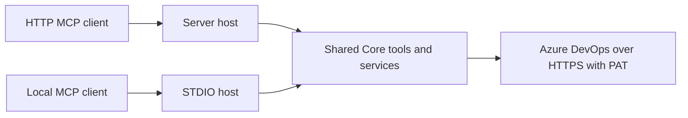

# STDIO setup and error handling

This guide covers the .NET STDIO host, configuration shared with HTTP, and recovery from Azure DevOps tool failures. See the [README tool catalog](../README.md#available-tools) for all 49 tools.

## Choose a transport

| Transport | Host | Connection | Client authentication |
|-----------|------|------------|-----------------------|
| HTTP | `Viamus.Azure.Devops.Mcp.Server` | MCP endpoint over HTTP, or HTTPS with TLS configured | Optional MCP API key |
| STDIO | `Viamus.Azure.Devops.Mcp.Stdio` | A local process launched by the MCP client | Local process and configuration access |

Both hosts use the same Core assembly, tool catalog, organization selection, PAT credentials, and error contract. STDIO opens no listening port and has no `/health` endpoint. `ServerSecurity` settings apply only to HTTP; an MCP API key is separate from the PAT used to access Azure DevOps.



## Publish and configure STDIO

From the repository root, use the .NET 10 SDK to publish:

```bash
dotnet publish src/Viamus.Azure.Devops.Mcp.Stdio -c Release --self-contained false -o ./publish/stdio
```

This distribution requires the .NET 10 runtime on the machine that launches it. For clients that use the `mcpServers` configuration layout, use an absolute DLL path and configure the child process environment:

```json
{
  "mcpServers": {
    "azure-devops": {
      "command": "dotnet",
      "args": ["C:/path/to/mcp-azure-devops/publish/stdio/Viamus.Azure.Devops.Mcp.Stdio.dll"],
      "env": {
        "AzureDevOps__OrganizationUrl": "https://dev.azure.com/your-organization",
        "AzureDevOps__PersonalAccessToken": "your-pat",
        "AzureDevOps__DefaultProject": "your-project"
      }
    }
  }
}
```

Replace the path and placeholder values before connecting. Store the PAT using your client's private configuration or secret injection. The `env` object is passed to the host process.

To include the runtime in a Windows x64 distribution:

```bash
dotnet publish src/Viamus.Azure.Devops.Mcp.Stdio -c Release -r win-x64 --self-contained true -o ./publish/stdio-win-x64
```

Set the client's `command` to the absolute path of the published `Viamus.Azure.Devops.Mcp.Stdio.exe` and omit `args`. Other operating systems require a distribution published for their runtime identifier.

Build or publish before attaching a client. Launch the published DLL or executable directly: build output from `dotnet run` can interfere with the protocol stream. At runtime, stdout carries MCP JSON-RPC messages and all console logs go to stderr. Do not merge stderr into stdout or wrap the command in a script that prints banners to stdout.

## Configuration sources

STDIO reads `appsettings.json` and optional environment-specific settings beside the executable, regardless of the client's working directory. Environment variables override JSON settings; command-line settings override environment variables. Environment keys use double underscores, for example `AzureDevOps__PersonalAccessToken`.

The .NET hosts do not load `.env` automatically. [Docker Compose](../docker-compose.yml) maps names such as `AZURE_DEVOPS_PAT` from `.env` to the .NET key `AzureDevOps__PersonalAccessToken`. Use the .NET keys when configuring an MCP process or running a host directly.

For direct HTTP development, configure the current shell before launching the host.

**PowerShell:**

```powershell
$env:AzureDevOps__OrganizationUrl = "https://dev.azure.com/your-organization"
$env:AzureDevOps__PersonalAccessToken = "your-pat"
$env:AzureDevOps__DefaultProject = "your-project"
dotnet run --project src/Viamus.Azure.Devops.Mcp.Server
```

**Bash:**

```bash
export AzureDevOps__OrganizationUrl="https://dev.azure.com/your-organization"
export AzureDevOps__PersonalAccessToken="your-pat"
export AzureDevOps__DefaultProject="your-project"
dotnet run --project src/Viamus.Azure.Devops.Mcp.Server
```

Use your local secret injection mechanism in place of the placeholder PAT. Avoid placing real credentials in committed files or command-line arguments.

### Multiple organizations

Replace the client's single-organization `env` object with the following configuration:

```json
{
  "AzureDevOps__OrganizationUrl": "",
  "AzureDevOps__PersonalAccessToken": "",
  "AzureDevOps__DefaultOrganization": "primary",
  "AzureDevOps__Organizations__0__Name": "primary",
  "AzureDevOps__Organizations__0__OrganizationUrl": "https://dev.azure.com/primary-org",
  "AzureDevOps__Organizations__0__PersonalAccessToken": "primary-pat",
  "AzureDevOps__Organizations__0__DefaultProject": "primary-project",
  "AzureDevOps__Organizations__1__Name": "secondary",
  "AzureDevOps__Organizations__1__OrganizationUrl": "https://dev.azure.com/secondary-org",
  "AzureDevOps__Organizations__1__PersonalAccessToken": "secondary-pat",
  "AzureDevOps__Organizations__1__DefaultProject": "secondary-project"
}
```

The blank root URL/PAT override legacy single-organization values in lower-priority configuration. Both legacy root settings and the organization array are supported; leave the root settings populated only if you intend to configure that additional organization.

Tool calls may select an organization by configured `Name`, full URL, or Azure DevOps organization slug. Without an `organization` argument, the configured default is selected. For example, invoke `get_repositories` with these arguments to check the secondary organization's project:

```json
{
  "organization": "secondary",
  "project": "secondary-project"
}
```

Use one PAT per configured organization. After replacing a PAT or changing organization settings, restart the HTTP host or the STDIO process through the MCP client.

## Error contract

Failed tool calls set MCP `isError: true`. The text content contains a JSON object with these fields:

```json
{
  "error": "Azure DevOps authentication failed. The PAT may be expired, revoked, or invalid. Replace the PAT for the selected organization, check access, and restart the host if configuration changed.",
  "errorCode": "AZURE_DEVOPS_AUTHENTICATION_FAILED",
  "retryable": false,
  "httpStatusCode": 401
}
```

| Field | Meaning |
|-------|---------|
| `error` | Safe, actionable message; raw exception text and stack traces are excluded from classified failures |
| `errorCode` | Stable category to guide recovery |
| `retryable` | Whether the failure is classified as transient |
| `httpStatusCode` | Upstream HTTP status when available; otherwise `null` |

| Error code | Recovery |
|------------|----------|
| `AZURE_DEVOPS_AUTHENTICATION_FAILED` | Check the selected organization's PAT; replace an expired, revoked, or invalid token and restart the host |
| `AZURE_DEVOPS_FORBIDDEN` | Check PAT scopes and user access to the organization, project, and resource |
| `AZURE_DEVOPS_NOT_FOUND` | Check the resource ID, project, organization, and access |
| `INVALID_ARGUMENT` | Correct arguments, formats, field names, or allowed values |
| `AZURE_DEVOPS_CONFLICT` | Read the current resource state and resolve the conflict |
| `AZURE_DEVOPS_RATE_LIMITED` | Wait before another attempt |
| `AZURE_DEVOPS_UNAVAILABLE` | Check service availability and try later |
| `AZURE_DEVOPS_API_UNAVAILABLE` | Check the organization URL and support for the requested Azure DevOps API |
| `AZURE_DEVOPS_TIMEOUT` | Check service responsiveness and connectivity; try later |
| `AZURE_DEVOPS_NETWORK_ERROR` | Check DNS, connectivity, proxy settings, and the organization URL |
| `CONFIGURATION_ERROR` | Correct organization settings or the tool's organization selector |
| `UNEXPECTED_ERROR` | Inspect the sanitized diagnostic category and reproduce with a valid configuration |

The transient categories are rate limiting, server unavailability, timeout, and network errors. The host does not automatically repeat tool calls. Before repeating a write after a timeout or network failure, read the affected resource to determine whether the first attempt completed. Client-requested cancellation remains cancellation, rather than being presented as a timeout.

### Recover from PAT authentication failures

1. Identify the organization selected by the failed call, including the fallback default when `organization` was omitted.
2. Check the token and its expiration/revocation in that organization. A 401 alone does not distinguish an expired token from a revoked or invalid token.
3. Replace the corresponding PAT in the effective environment or private settings file. For STDIO, update the client's process environment; for Docker, update `.env` and recreate the service with `docker compose up -d`.
4. Restart the host process so its Azure DevOps connections use the new credentials.
5. Reconnect the MCP client and call a read tool, such as `get_repositories`, with the intended organization and project.

A 403 is a permission failure: check both token scopes and the user's resource permissions. Work item mutations require Work Items Read & Write; pull request creation, updates, threads, and comments require Code Read & Write; build queries require Build Read; Wiki tools require Wiki Read (`vso.wiki`), as documented in the [Wiki API scope reference](https://learn.microsoft.com/en-us/rest/api/azure/devops/wiki/wikis/list?view=azure-devops-rest-7.1#security). Read-only workflows can use the corresponding read scopes.

### Startup and transport diagnostics

| Symptom | What to check |
|---------|---------------|
| STDIO exits with code 1 before initialization | Configure a URL and PAT for at least one organization; inspect the sanitized stderr message and the settings beside the executable |
| STDIO client reports invalid JSON or framing errors | Launch the published host directly and keep logs, build output, and script output out of stdout |
| HTTP request returns 401 before a tool runs | Supply the MCP API key as `X-API-Key` or `Authorization: Bearer`; this is separate from Azure DevOps PAT authentication |
| Initialization and tool discovery succeed, but an Azure operation fails | Discovery does not authenticate the PAT; diagnose the failed read or write using its error code |
| `/health` is healthy, but an Azure operation fails | The HTTP health check verifies the host, not Azure DevOps authorization |
| A cleartext Azure DevOps URL fails with `UNEXPECTED_ERROR` | Use an HTTPS organization URL; the Azure SDK may reject insecure Basic authentication before making a request |

The HTTP MCP endpoint can use local HTTP independently of the upstream Azure DevOps URL; configure HTTPS for the upstream PAT connection. A requested Wiki resource returning HTTP 404 can produce an empty/not-found result. API discovery failures, authentication errors, and connectivity failures are not treated as an absent Wiki resource.

## Implementation and validation references

- [Shared registration](../src/Viamus.Azure.Devops.Mcp.Core/AzureDevOpsMcpServiceCollectionExtensions.cs)
- [Configuration validation](../src/Viamus.Azure.Devops.Mcp.Core/Configuration/AzureDevOpsConfigurationValidator.cs)
- [Error classification](../src/Viamus.Azure.Devops.Mcp.Core/Errors/AzureDevOpsErrorClassifier.cs) and [tool error boundary](../src/Viamus.Azure.Devops.Mcp.Core/Errors/AzureDevOpsErrorHandlingTool.cs)
- [STDIO host configuration](../src/Viamus.Azure.Devops.Mcp.Stdio/StdioHost.cs)
- [Transport tests](../tests/Viamus.Azure.Devops.Mcp.Server.Tests/Transport) and [STDIO host/process tests](../tests/Viamus.Azure.Devops.Mcp.Stdio.Tests)

Automated tests exercise both MCP transports locally, including simulated Azure DevOps failures. They do not establish that a real PAT has access to a live Azure DevOps organization.
